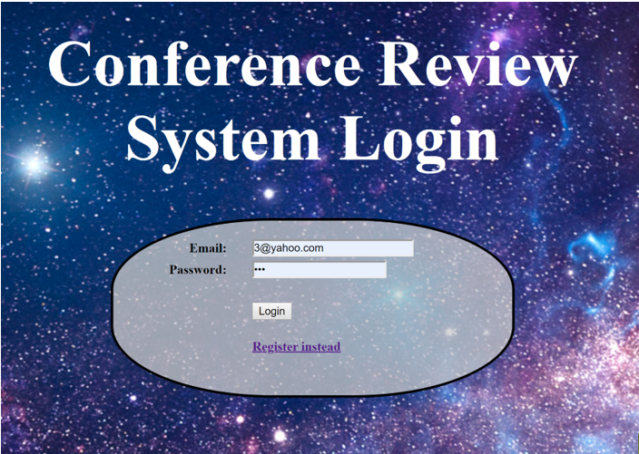

# finalprojectdatabase
Conference Review System 

User Manual:

1.	This is the login page (http://localhost:8080/login).
The user could enter already existing account information or they can create a new account by clicking the ‘Register Instead’ link. 
       

2.	This is the registration page (http://localhost:8080/registration). 
The user is able to create a new account by providing specific  information, as listed in the below image. They must select a role option - Author, Reviewer or both -- this option is what determines the different accessibilities the user will have. If they would like to go to the login page, they may select ‘login instead’.
            

3.	This is an example of a user who is both an author and a reviewer (their first name is shown in the header).
They are given all options - to review/rate papers, lookup papers, view all papers, and even create papers. A user who is only an author will not have the option ‘review paper’. Likewise, a user who is only a reviewer will not have the option “create new paper”.
 

4.	This page allows the user to view the list of existing papers. 
If the user clicks the paperid, it will lead them to Lookup paper page, where they will be able to see the ratings of the specific paper.   
 

5.	The Lookup Paper page allows the user to view more details on the paper, such as rating, recommendations, and more. 
The user is also able to search up a paper id, which will also provide the details for that paperid. 
          
 
6.	The review paper page allows the user to enter in a paperid they wish to review, rate the different categories, and leave comments for the authors and other reviewers. 
            

7.	The create a new paper page, as the name implies, allows the user to create a paper (entering in title, filename, and abstract), which will then be uploaded for review.
Amongst submission of the paper file, the application will create a unique paper id but increasing the last (max) paper id number by 1, making sure no id’s are repeated. 
             

Application Flow: 
 

